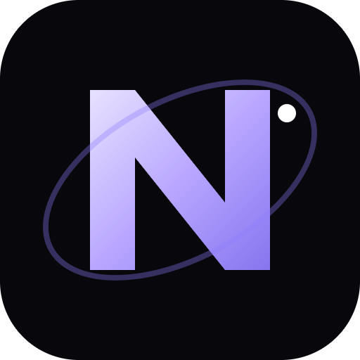
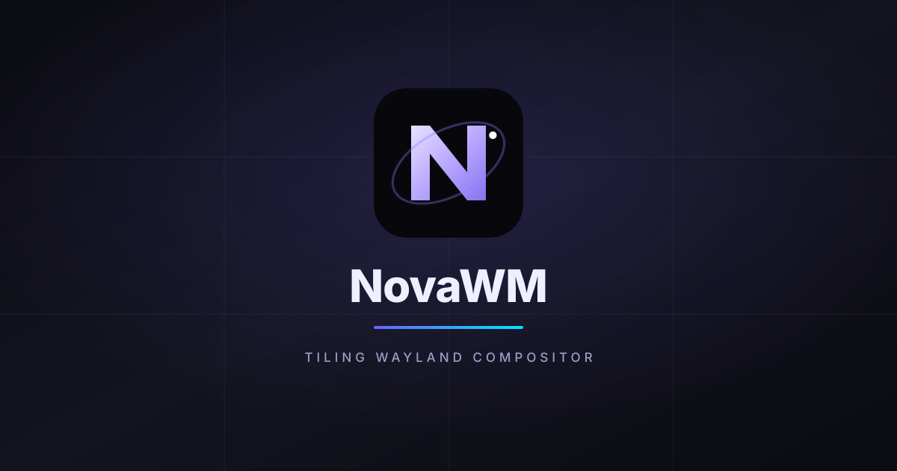
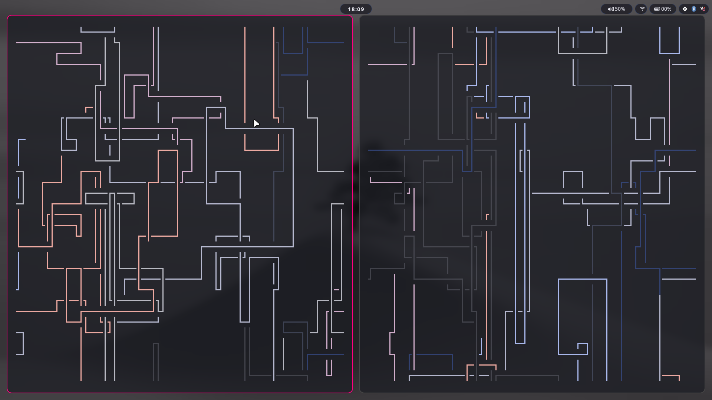
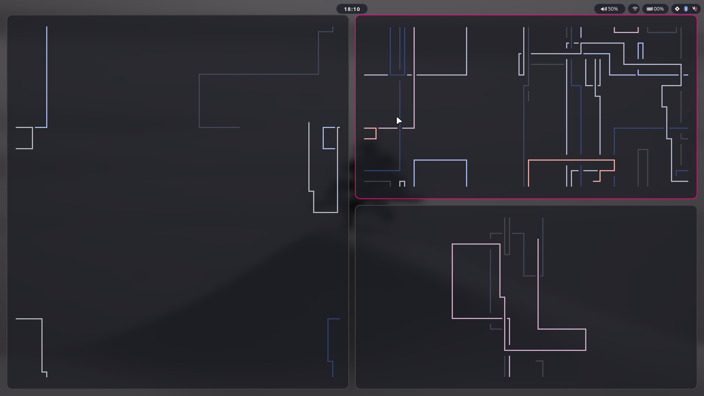
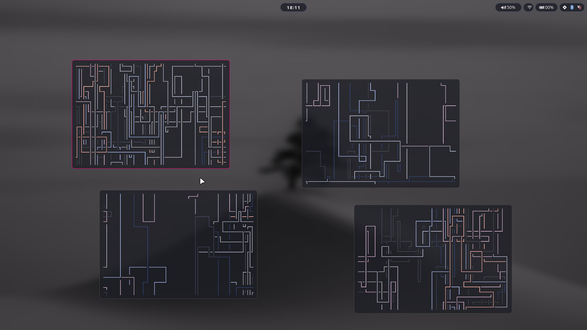

<p align="center">
  
  <br/>
  
</p>

<br/>

<p align="center">
  <a href="LICENSE"></a>
  
  
  
</p>

<br/>

<p align="center">
  <strong>Scroll</strong> · <strong>Dwindle</strong> · <strong>Canvas</strong>
  <br/>
  <sub>A tiling Wayland compositor built on <a href="https://smithay.github.io/index.html">Smithay</a>, designed for people who want a fast keyboard-driven desktop without the bloat.</sub>
</p>

<br/>

<p align="center">
  <a href="#install"></a>
  <a href="docs/"></a>
  <a href="#keybinds"></a>
  <a href="https://aur.archlinux.org/packages?K=novawm"></a>
</p>

<br/>

---

## What is this?

NovaWM is a manual tiling Wayland compositor. It draws directly to your display
via DRM/KMS - no X11, no Weston, no libweston. It is a compositor in the same
category as Hyprland, Sway, and niri, focused on a **three-layout model**
where you pick the layout that fits what you're doing and keybind the rest.

**Scroll layout** (niri-style): columns scroll horizontally, focused column
centered. **Dwindle layout**: binary split tree like i3/Hyprland.
**Canvas layout**: infinite zoomable workspace with free window placement.

### Compared to others

| | NovaWM | Sway | Hyprland | niri |
|---|---|---|---|---|
| Scroll/panning | ✅ | ✗ | ✗ | ✅ |
| Infinite canvas | ✅ | ✗ | ✗ | ✗ |
| Dwindle/binary | ✅ | ✅ | ✅ | ✗ |
| Built-in record | ✅ | ✗ | ✗ | ✗ |
| Session lock | ✅ | ✅ | ✅ | ✅ |
| Idle notify | ✅ | ✅ | ✅ | ✅ |
| Layer-shell | ✅ | ✅ | ✅ | ✅ |
| Screencast portal | ✅ | ✅ | ✅ | ✅ |
| Window rules | ✅ | ✗ | ✅ | ✗ |
| IPC | ✅ | ✅ | ✅ | ✅ |
| Xwayland | ✗ | ✅ | ✅ | ✗ |

<br/>

## Features

<details>
<summary><b>Scroll layout</b> (niri-style)</summary>

Column windows arranged left-to-right. Focused column centered on screen.
Custom per-window column widths via `Super+RightDrag`. Works across
multiple monitors with workspace isolation.

</details>

<details>
<summary><b>Dwindle layout</b> (i3-style)</summary>

Binary tree split. `Super+Enter` splits horizontally, `Super+V` splits
vertically. Focus with `Super+H/J/K/L`. `Super+F` maximizes/fills.

</details>

<details>
<summary><b>Canvas layout</b> (infinite workspace)</summary>

Free-form window placement on an infinite plane. `Super+Scroll` zoom to
cursor, `Super+Middle-drag` pan, `Super+Drag` windows. Full zoom/pan
animation via Smithay compositor camera.

</details>

<details>
<summary><b>Eye candy</b></summary>

Animated border effects: breathing, rainbow, gradient, glow, pulse, ember,
and chase modes. Corner rounding for windowed mode. Background blur.
Per-window opacity control via window rules.

</details>

<br/>

### Screenshots

<p align="center">
  
  
  <br/>
  
</p>
<br/>

---

## Install

### Arch Linux (recommended)

```bash
git clone https://github.com/nova-wm/nova && cd nova
makepkg -si
```

Then pick **NovaWM** in SDDM / GDM / LightDM / Ly, or run `novawm-session`
from a TTY.

### From a TTY directly

```bash
cargo build --release
./target/release/novawm drm
```

Full install notes: [docs/install.md](docs/install.md)

---

## Config

NovaWM reads KDL config files. First login seeds `~/.config/novawm/` from
system defaults. After that you edit directly.

```kdl
// ~/.config/novawm/config.kdl

modifier "super"
layout "scrolling"

gaps {
    inner 20
    outer 20
}

decorations {
    rounding 12
    border_width 2
    border_effect "breathing"
    blur #true
    opacity 0.9
}

startup "foot" "mako" "hypridle"
```

Full config reference: [docs/config.md](docs/config.md)

### Layouts

Layout is set in `config.kdl` (`layout "scrolling"` / `"dwindle"` / `"canvas"`)
or switched at runtime:

| Command | Description |
|---------|-------------|
| `novactl layout get` | Current layout |
| `novactl layout set scrolling` | Side-by-side columns, centered view |
| `novactl layout set dwindle` | Binary split tree |
| `novactl layout set canvas` | Infinite zoomable workspace |

Full layout docs: [docs/layouts.md](docs/layouts.md)

---

## Keybinds

All binds live in `keys.kdl` (editable). `mod` is the configured modifier
(Supers by default).

### Window management

| Bind | Action |
|------|--------|
| `mod+Return` | Spawn terminal |
| `mod+c` | Close focused window |
| `mod+f` | Fullscreen |
| `mod+v` | Toggle float |
| `mod+grave` | Toggle scratchpad |
| `mod+o` | Layout overview |
| `mod+Shift+r` | Toggle screen record |
| `mod+mouse:272` (drag) | Move window |
| `mod+mouse:273` (drag) | Resize window |

### Focus

| Bind | Action |
|------|--------|
| `mod+h` / `mod+Shift+h` | Focus / move focus left |
| `mod+l` / `mod+Shift+l` | Focus / move focus right |
| `mod+j` / `mod+Shift+j` | Focus / move window down |
| `mod+k` / `mod+Shift+k` | Focus / move window up |
| `mod+Tab` / `mod+Shift+Tab` | Cycle focused window |

### Workspaces

| Bind | Action |
|------|--------|
| `mod+1` … `mod+9` | Switch to workspace 1–9 |

### Canvas (only when `layout "canvas"` is active)

`config.kdl` sets the layout; the canvas adds its own binds:
`mod+equal`/`mod+minus` zoom in/out, `mod+0` resets, `mod+x` centers the
focused window, `mod+w` zooms to fit, `mod+a` homes the view, `mod+t` pins a
window. `mod+scroll` zooms around the cursor; `mod+drag` on empty space pans.

### Editing keybinds

The repo ships `keys.kdl` (main binds) and `canvas_keys.kdl` (canvas-only).
They are `include`d from `config.kdl`. App launcher and lock-screen binds are
commented out by default - uncomment the entry you like:

```kdl
bind "mod+d" "spawn fuzzel"          // or wofi / rofi / qs
bind "mod+shift+s" "spawn novactl screenshot area copy"
bind "mod+l"   "spawn swaylock"      // needs ext-session-lock
```

Full keybind reference: [docs/keys.md](docs/keys.md)

---

## Architecture

NovaWM is structured as a single `novawm` binary plus `novactl` CLI tool:

```
NovaWM
├── src/
│   ├── main.rs          # entry point, event loop, logging
│   ├── state.rs         # Smallvil - compositor state machine (4k+ lines)
│   ├── drm.rs           # DRM/KMS output, rendering, layer-shell compositing
│   ├── drm_cursor.rs    # hardware cursor planes + multi-GPU abstraction
│   ├── config.rs        # KDL config parser (custom, no external parser)
│   ├── input.rs         # libinput event routing, gesture handling
│   ├── layout.rs        # scroll + dwindle + canvas layout engines
│   ├── border.rs        # animated border shaders (GLES)
│   ├── ipc.rs           # Unix socket control interface
│   ├── record.rs        # built-in screen recorder (ffmpeg pipe)
│   ├── screenshot.rs    # screenshot + region select
│   ├── winit.rs         # nested Wayland backend (for development)
│   ├── handlers/        # Wayland protocol implementations
│   └── grabs/           # move, resize, and tile-resize grabs
├── src/bin/
│   └── novactl.rs       # CLI for IPC control
└── config.kdl           # default config
```

Smithay provides the low-level Wayland protocol machinery. NovaWM builds the
rendering, input handling, layout logic, and IPC on top of it.

Docs: [docs/](docs/) - install, config, layouts, session tools, portals.

---

## novactl

The built-in CLI for controlling NovaWM over its IPC socket:

```bash
novactl list-windows          # all windows: index, app_id, title, output, workspace
novactl monitors              # connected outputs with geometry
novactl layers                # layer-shell surfaces (quickshell debug)
novactl layout get            # current layout name
novactl layout set dwindle    # switch layout (scroll | dwindle | canvas)
novactl close 3               # close window by index
novactl screenshot area copy  # screenshot selection → clipboard
novactl record                # record to ~/Videos/
novactl record stop           # finalize recording
novactl status                # compositor status
novactl stop                  # quit NovaWM
```

---

## Troubleshooting

### kitty is laggy / stutters when large

By default kitty paces its render loop off the compositor's frame callbacks
(`sync_to_monitor yes`). On some drivers that drops frames on big windows.
Add this to `~/.config/kitty/kitty.conf`:

```
sync_to_monitor no
```

---

## What NovaWM is not

NovaWM is intentionally **not** a full desktop environment. It is a compositor.
For everything else, you pick your tools:

| Need | Recommendation |
|------|---------------|
| App launcher | fuzzel / wofi / rofi |
| Notifications | mako / swaync |
| Idle daemon | hypridle / swayidle |
| Lock screen | swaylock / hyprlock |
| Shell widgets | quickshell |
| Logout menu | wlogout |
| Wallpaper | built-in path or swaybg |

NovaWM speaks the Wayland protocols these tools need - layer-shell, idle
notify, session lock, xdg-output, fractional-scale, viewporter, and the
modern screen capture protocols.

---

## Contributing

This is a solo project in active development. Issues and PRs are welcome but
there is no formal contribution guide yet.

Clone and build:
```bash
git clone https://github.com/nova-wm/nova && cd nova
cargo build --release
./target/release/novawm drm     # from a TTY (not SDDM/GDM session)
```

---

## License

NovaWM is licensed under the [GNU Affero General Public License v3.0](LICENSE).

Copyright (c) 2025–2026 frqme and NovaWM contributors.
